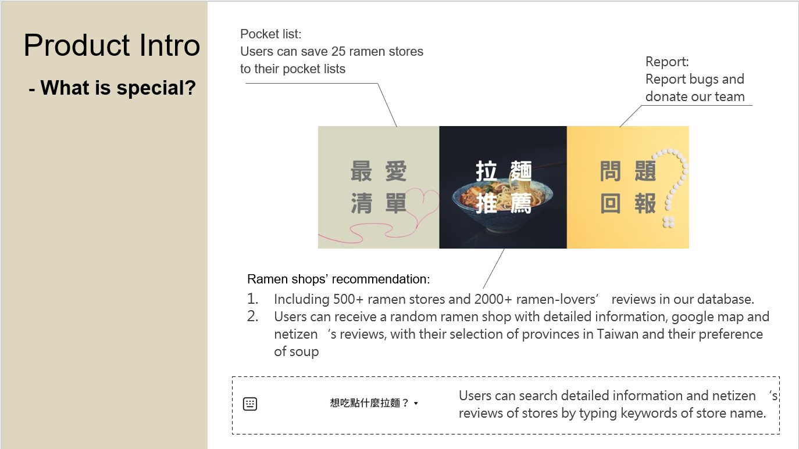
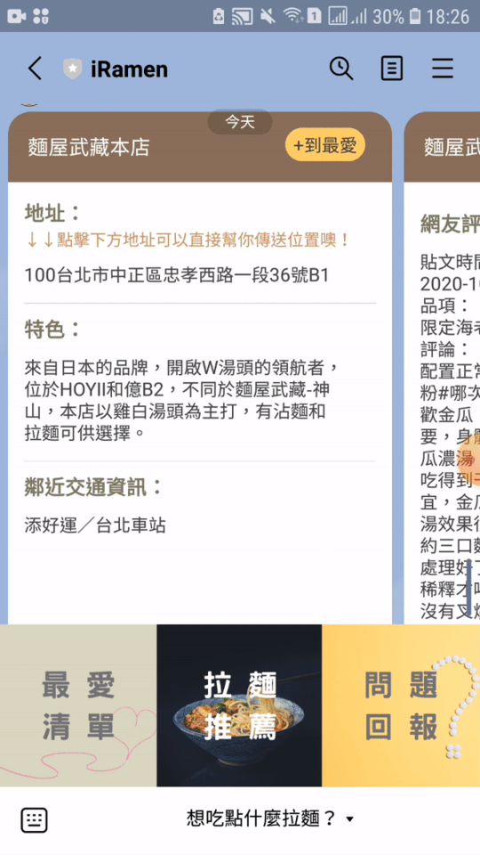
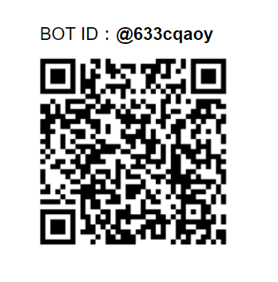
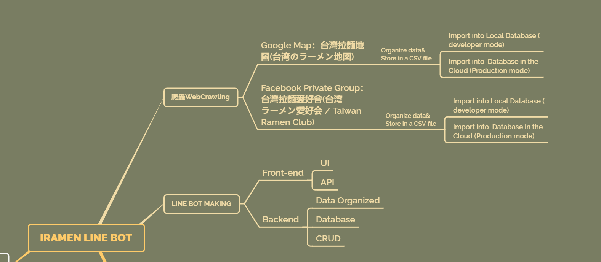
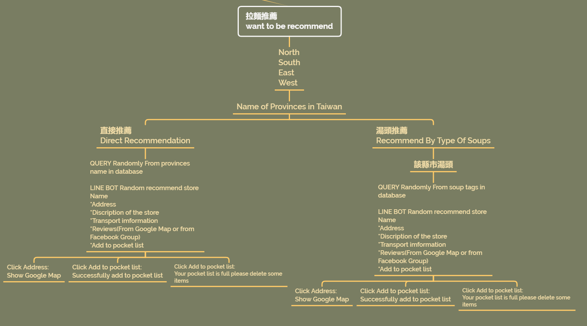
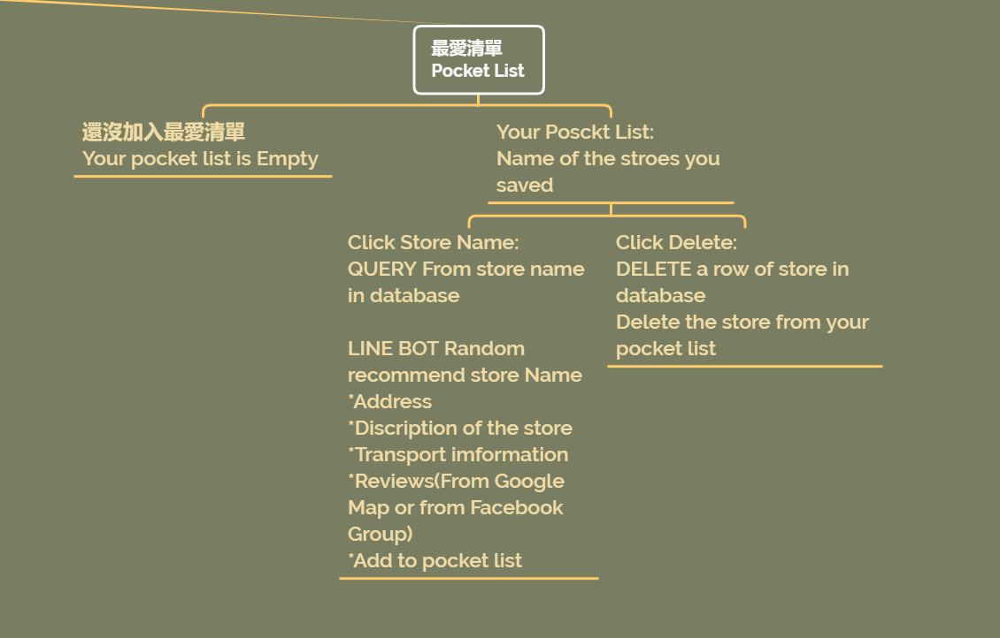
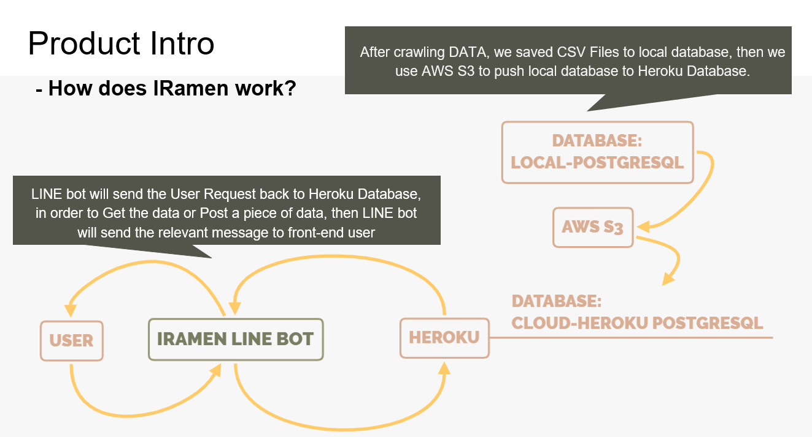
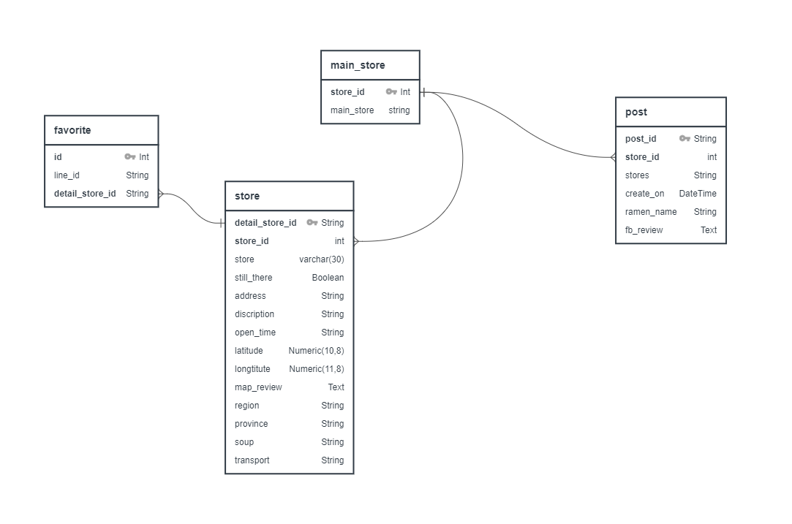
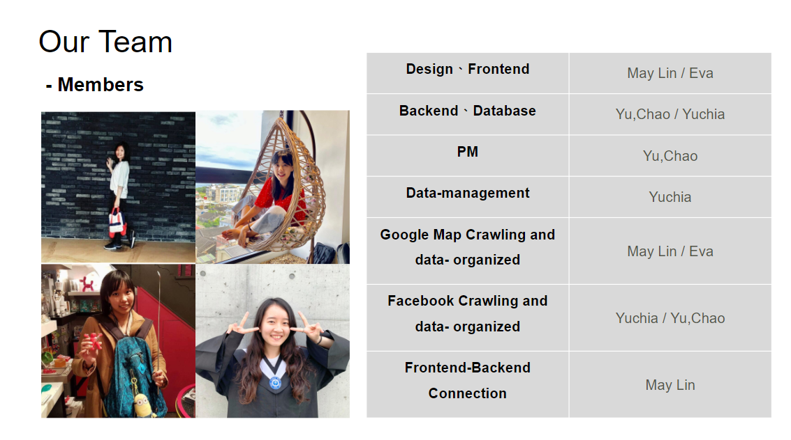

# :ramen:iRamen_linebot:ramen:
A [ramen](https://en.wikipedia.org/wiki/Ramen) recommendation LINE bot to help Taiwanese's ramen lovers choosing ramen stores in Taiwan.

### :ramen:Our Goal
* We are a group of ramen-lovers, our goal is to make a prototype of a mobile-first ramen recommendation chat bot in order to help other ramen lovers, if they have problem of choosing ramen shops in Taiwan.
* Develop the glorious ramen shops in Taiwan.
* Finish National Taiwan University [ccClub 2020 fall](https://www.ccclub.io/home/) final project.

### :ramen:App demo and features
* General features:

* Recommendation with Google Map 

* Add your favorite Ramen stores to Pocket List

* The interface is in Manderin.

### :ramen:Setup
0. Download [LINE](https://line.me/en/download) in your mobile and create an account for yourself.
1. Add official ID `633cqaoy` or scan the QRcode below to add IRAMEN to your friend list. 

2. You can start to use our IRAMEN LINE BOT

### :ramen:If you want to use our seperated packages for web-scraping
Source website:[台灣拉麵愛好會(台湾ラーメン愛好会 / Taiwan Ramen Club)](https://www.facebook.com/groups/RamenTW)
* Facebook private group online crawling and organizing the post contents.

#### Facebook Private Group Crawling
Run `the facebook_crawling.py`
* Step 1: install selenium and webdriver and the required packages
* Step 2: set your username and password in .env
* Step 3: change the chromedriver_path and the url of the website you want to crawl
* Step 4: set the number of iteration for dynamic page scrolling in the main function
* Step 5: name the output file in main funtion

---

#### Data Organization
The task at this stage is to conbime the **Google map crawling** and **Facebook crawling files**. 
First of all, both of the crawling files will undergo text preprocessing in order to provide the correct information we need.
Then, We match the same ramen stores appearing in the both files, and label them with the same id.
Therefore, the final 3 Csv files are produced:

  1. **Main_Store.csv:** 
      * `store_id`: the id of the non-overlapped ramen brands in Taiwan.
      * `main_store`: the name of the non-overlapped ramen brands in Taiwan.
  2. **Store.csv:**
      * `detail_store_id`: the unique id of each store in the table for database to recognize.
      * `store_id`: according to the ramen brands in Main_Store.csv, the stores that match with the brands will have the same id.
      * `store`: the ramen store names we've crawled including main stores and detail stores.
      * `still there`: whether the stores still open.
      * `address`: the address of each store.
      * `description`: the introduction of the store.
      * `opne time`: the open time of the store.
      * `latitude`: the latitude of the store's location. 
      * `longtitute`: the latitude of the store's location. 
      * `map_review`: the feedback post link of this store in the private facebook group.
      * `region`: the region (North, East, South, West) where the ramen store is located.
      * `province`: the city which the ramen store is located.
      * `soup`: the representive soup flavor tags for this store.
      * `transport`: the nearby landmarks or the transportation information for the store.
  3. **Post.csv**
      * `post_id`: the unique id of each post in the table for database to recognize.
      * `store_id`: according to the ramen brands in Main_Store.csv, the store of the post that matches the brands will have the same id.
      * `stores`: the store name that the post introduces.
      * `create_on`: the published time of the post.
      * `ramen_name`: the ramen name that the post introduces.
      * `fb_review`: the feedback after visiting this store in this post.

####  Procedure:
* Step 1: Run `map_store_table.ipynb`
    * Input the Map_Ramen_data_with_city.csv (the data you crawl)
    * Group the same brands of the stores, and select the non-overlapped ramen brands for Main_Store.csv
    * Label all of the stores and output Store.csv 
* Step 2: Run `fb_post_table.ipynb`
    * Input fb_crawling_output.csv (the data you crawl)
    * Preprocessing the post's contents and published time
    * Match the store name of the post according to the Main_Store.csv to create the ids and output Post.csv

Source website:[【台灣拉麵愛好會專屬】Ramen Map](https://www.google.com/maps/d/u/0/viewer?fbclid=IwAR3O8PKxMuqtqb2wMKoHKe4cCETwnT2RSCZSpsyPPkFsJ6NpstcrDcjhO2k&mid=1I8nWhKMX1j8I2bUkN4qN3-FSyFCCsCh7&ll=24.807740000000006%2C120.96740199999999&z=8)

### :ramen:Chart-flow for our bot

### :ramen:Used modules, technologies and concepts
* Front-end: Python, line-bot-sdk-python, JSON
* Data-scraping/data organized: Python, selenium, selenium IDE, pandas, python-dotenv
* Back-end and database: Python, Postgresql, Flask, Flask-Sqlalchemy, psycopg2, psycopg2-binary, python-dotenv, AWS S3, Heroku-database, Postman

### :ramen:Autor
* [Yu Chao](https://github.com/troublecat55)
* [May Lin](https://github.com/yumei86)
* [Yuchia](https://github.com/yuchiaa)
* [Chi Hsin Tseng](https://github.com/ChiHsinTseng)

### :ramen:Team work
* PM method: Agile, sprintes

### :ramen:License
[MIT](https://choosealicense.com/licenses/mit/)
